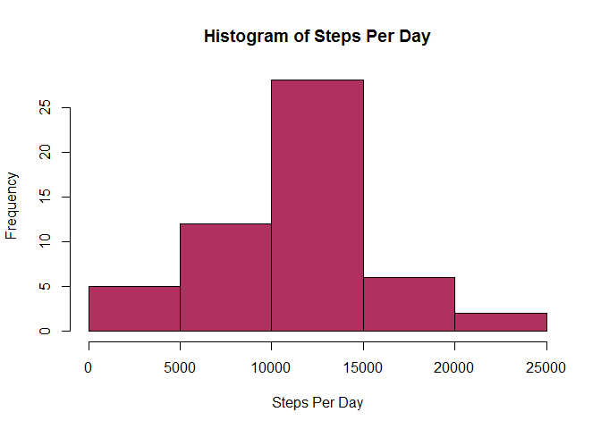
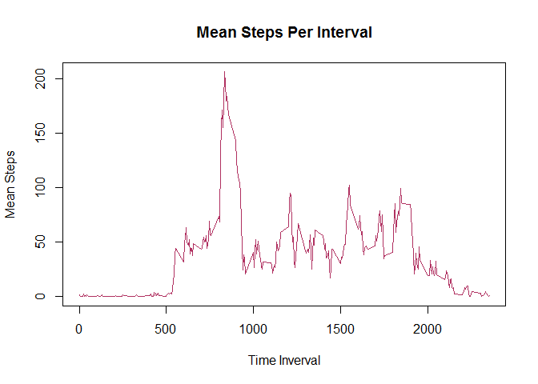
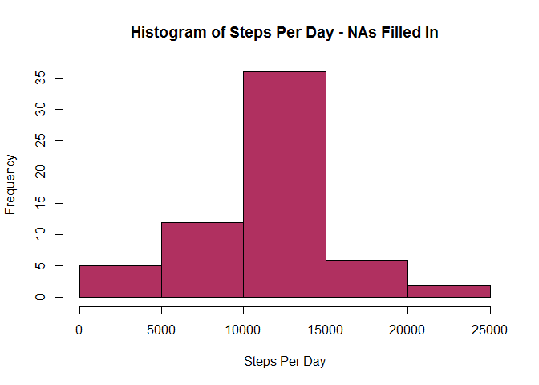
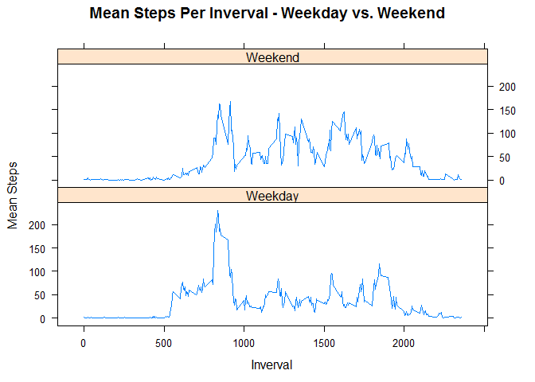

# Reproducible Research: Peer Assessment 1


## Loading and preprocessing the data


```r
library(knitr)
library(dplyr)
```

```
## Warning: package 'dplyr' was built under R version 3.2.3
```

```
## 
## Attaching package: 'dplyr'
```

```
## The following objects are masked from 'package:stats':
## 
##     filter, lag
```

```
## The following objects are masked from 'package:base':
## 
##     intersect, setdiff, setequal, union
```

```r
library(lattice)
setwd("C:/Users/bkindle/Desktop/Data Science/5 - Reproducable Research/Project1/RepData_PeerAssessment1")
a <- read.csv("activity.csv")
```

## What is mean total number of steps taken per day?


```r
b <- filter(a, !is.na(steps))
c <- group_by(b, date) %>% summarize(steps_per_day = sum(steps))

# Histogram of Steps Per Day
hist(c$steps_per_day, main="Histogram of Steps Per Day", 
     xlab="Steps Per Day", ylab="Frequency", col="maroon")
```

\

```r
# Mean and Median Steps Per Day
d <- mean(c$steps_per_day)
e <- median(c$steps_per_day)
print(paste("Mean1:",d))
```

```
## [1] "Mean1: 10766.1886792453"
```

```r
print(paste("Median1:",e))
```

```
## [1] "Median1: 10765"
```

## What is the average daily activity pattern?


```r
# Time Series Plot
f <- group_by(b, interval) %>% summarize(mean_steps_per_day = mean(steps))
plot(y=f$mean_steps_per_day, x=f$interval, type='l', main="Mean Steps Per Interval",
     ylab="Mean Steps", xlab="Time Inverval", col="maroon")
```

\

```r
# Maximum Inverval
g <- select(filter(f, mean_steps_per_day==max(mean_steps_per_day)),interval)
print(paste("Maximum Interval:",g))
```

```
## [1] "Maximum Interval: 835"
```

## Imputing missing values


```r
# Count Rows with NA
h <- count(filter(a, is.na(steps)))
print(paste("Count:",h))
```

```
## [1] "Count: 2304"
```

```r
# Fill in missing values (NAs) with the ceiling of the average for that time interval
i <- filter(a, is.na(steps))
j <- left_join(i, f, by.x = interval, by.y=interval)
```

```
## Joining by: "interval"
```

```r
j$mean_steps_per_day = ceiling(j$mean_steps_per_day)
k <- select(j, c(mean_steps_per_day, date, interval)) %>% rename(steps=mean_steps_per_day)
l <- rbind(k, b)
m <- arrange(l, date)
n <- group_by(m, date) %>% summarize(steps_per_day = sum(steps))

# # Histogram, mean, and median of Steps Per Day with NAs filled in
hist(n$steps_per_day, main="Histogram of Steps Per Day - NAs Filled In", 
     xlab="Steps Per Day", ylab="Frequency", col="maroon")
```

\

```r
o <- mean(n$steps_per_day)
p <- median(n$steps_per_day)
print(paste("Mean2:",o))
```

```
## [1] "Mean2: 10784.9180327869"
```

```r
print(paste("Median2:",p))
```

```
## [1] "Median2: 10909"
```

```r
# Comparison of NAs excluded vs. NAs filled in
diffo <- o-d
diffp <- p-e
print(paste("Mean Steps Per Day (excluding NAs):",d))
```

```
## [1] "Mean Steps Per Day (excluding NAs): 10766.1886792453"
```

```r
print(paste("Mean Steps Per Day (NAs filled in):",o))
```

```
## [1] "Mean Steps Per Day (NAs filled in): 10784.9180327869"
```

```r
print(paste("Difference Between Means:",diffo))
```

```
## [1] "Difference Between Means: 18.7293535416029"
```

```r
print(paste("Median Steps Per Day (excluding NAs):",e))
```

```
## [1] "Median Steps Per Day (excluding NAs): 10765"
```

```r
print(paste("Median Steps Per Day (NAs filled in):",p))
```

```
## [1] "Median Steps Per Day (NAs filled in): 10909"
```

```r
print(paste("Difference Between Medians:",diffp))
```

```
## [1] "Difference Between Medians: 144"
```

## Are there differences in activity patterns between weekdays and weekends?


```r
# Weekdays vs. Weekends
m$day_type <- ifelse(toupper(weekdays(as.Date(m$date))) %in% c("SATURDAY","SUNDAY"),"Weekend","Weekday")

# Time Series Lattice Plot By Day Type
q <- group_by(m, day_type, interval) %>% summarize(mean_steps_per_day = mean(steps))
xyplot(data = q, mean_steps_per_day~interval|day_type, layout=c(1,2), type='l',
	 main="Mean Steps Per Inverval - Weekday vs. Weekend", xlab="Inverval", ylab="Mean Steps")
```

\
